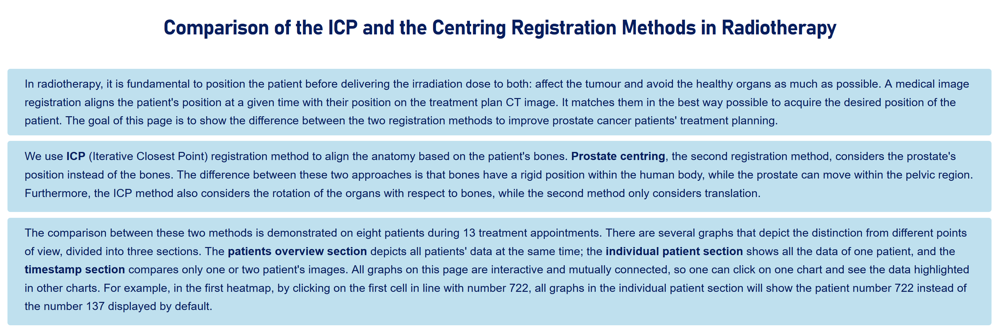
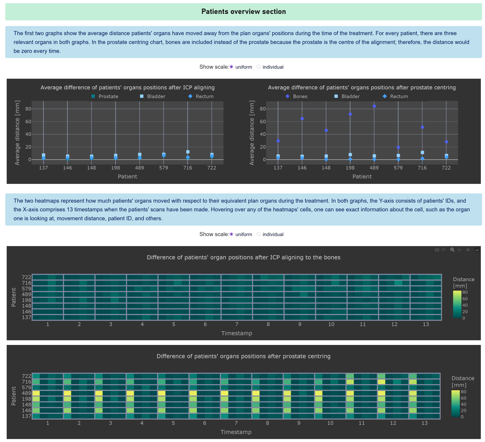
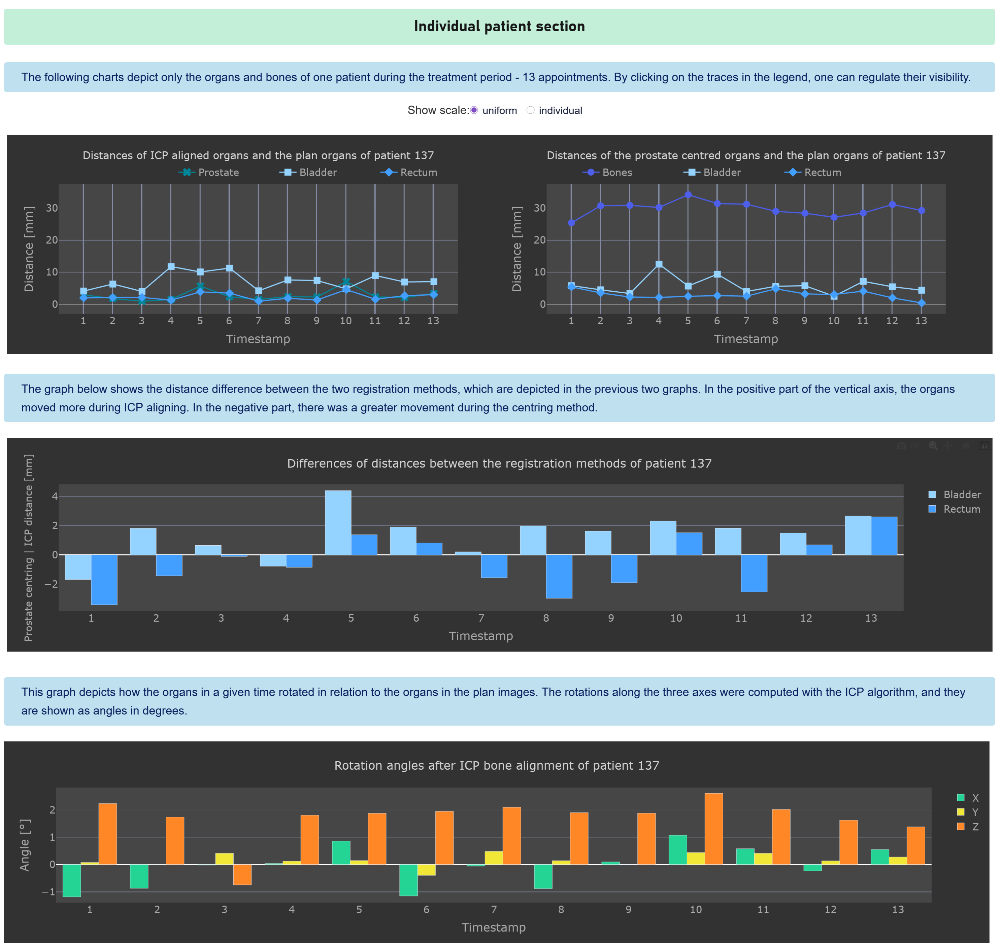
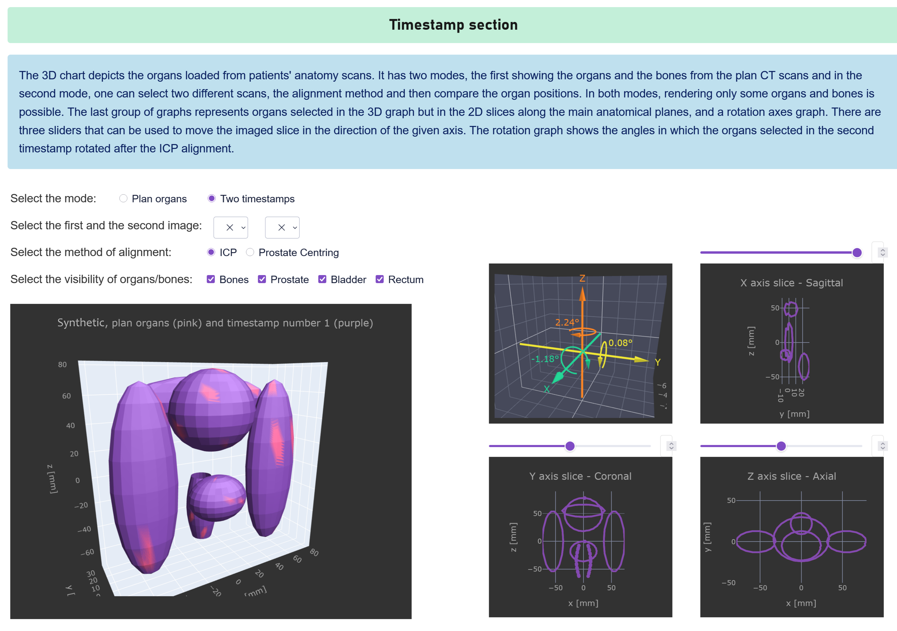

# Registration Methods – Visual Comparison

Interactive Python application for comparing two registration methods used in
prostate cancer radiotherapy:

- **ICP (Iterative Closest Point) registration**
- **Prostate-centering registration**

The application combines 3D mesh processing, registration calculations, numerical
analysis, and interactive visualization to investigate how the two methods affect
the positioning of anatomical structures during treatment.

## Application

### Introduction

Overview of the registration problem, the two methods, and the purpose of the
comparison.



### Patients overview

Interactive comparison of the registration results across patients and treatment
timestamps, including displacement plots and heatmaps.



### Individual patient analysis

Detailed analysis of a selected patient, including changes in organ position,
differences between the registration methods, and rotation measurements obtained
from ICP.



### 3D visualization

Interactive visualization of the anatomical structures, registration results,
and different anatomical views.

The original application uses patient-derived medical data. The visualization
shown here uses synthetic meshes created specifically for this repository, so
that the 3D functionality can be demonstrated without distributing confidential
patient data.



## Data
The application can be demonstrated using the precomputed data included in
the `computations_files` directory. This allows the majority of the
visualizations and analyses to be used without access to the original
patient dataset.

The original patient-specific anatomical meshes are required only for the
3D visualization and timestamp analysis. They are not included in this
repository because the data is confidential.

Synthetic anatomical meshes are provided to demonstrate the 3D visualization
without distributing patient-derived data.

## Setup

Install the required Python packages:

```bash
pip install numpy trimesh pywavefront scipy plotly dash
```

Place the project files and available data in the required directory structure and update `FILEPATH` in `constants.py` accordingly.

Run the application with:

```bash
python application_dash.py
```

### Notes
Within the source code and documentation, RM is used as an abbreviation for registration method.
